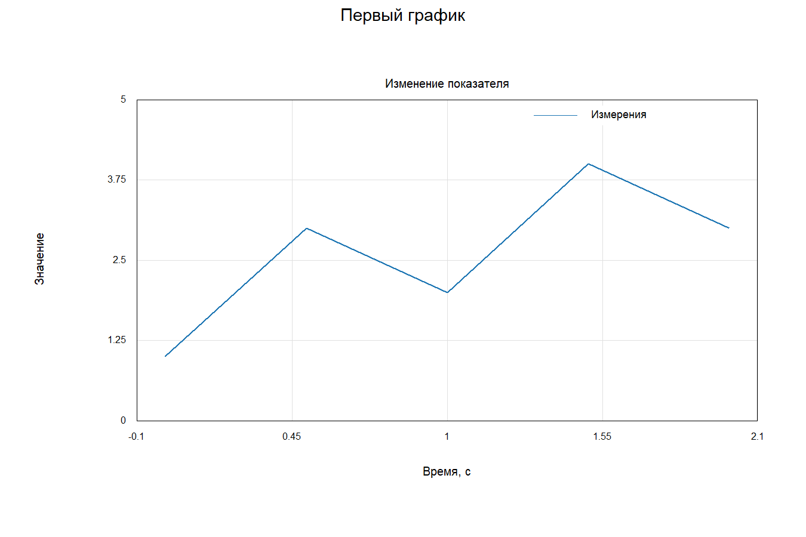
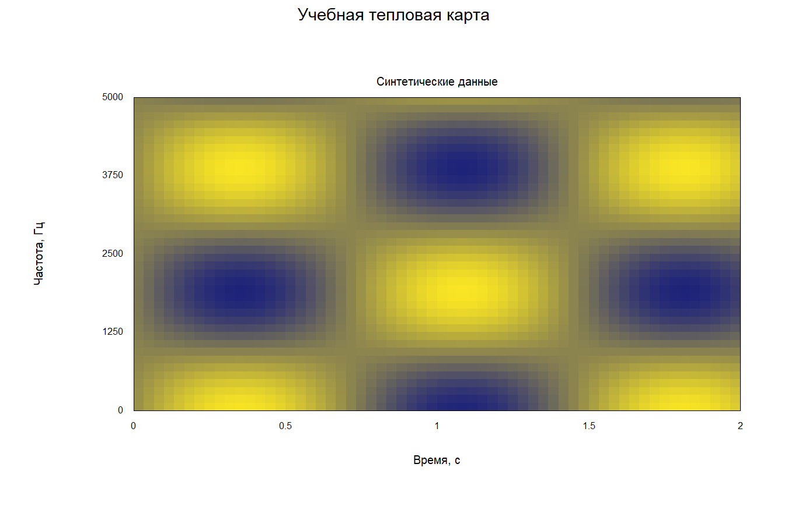

# Графики на Lua в Praat Custom

Практическая методичка • версия от 12 сентября 2026 года

**Цель:** научиться строить графики своих данных, сохранять изображения и
показывать результаты рядом со звуком или поверх спектрограммы.

Методичка рассчитана на нашу сборку **Praat Custom с `praat.plot`**.
В обычном Praat этого модуля нет. API похож на matplotlib по организации
figure/axes, но поддерживает только описанные здесь возможности.

## Как работать с методичкой

1. Запустите `dist/praat-custom.exe` из проекта или `praat-custom.exe` из поставки.
2. В Objects выберите **Praat → Open Lua script...**.
3. Откройте нужный файл из папки [examples](examples).
4. Нажмите **F7** для проверки синтаксиса, затем **F5** для выполнения.
5. После изменения файла сохраните его через Ctrl+S и запустите снова.

Все нумерованные примеры самостоятельны. Для занятий 1–7 открывать звук
заранее не требуется. Занятия 7–9 создают учебные объекты Praat; повторный запуск
создаёт новые объекты. Занятие 10 работает с выбранным пользователем объектом.
`print(...)` выводит сообщения в **Praat Info**.

Работайте по порядку: первые занятия объясняют данные и оси, следующие —
встраивание и экспорт. Каждый кодовый блок с пометкой «Файл» совпадает
с соответствующим файлом в examples.

## 1. Первый линейный график

Откройте [01-first.lua](examples/01-first.lua).

```lua
-- Файл: 01-first.lua
local plt = require('praat.plot')
local fig, ax = plt.subplots(1, 1, {title='Первый график'})

local time = {0, 0.5, 1.0, 1.5, 2.0}
local value = {1, 3, 2, 4, 3}
ax:plot(time, value, {color='#1f77b4', linewidth=2, label='Измерения'})
ax:set_title('Изменение показателя')
ax:set_xlabel('Время, с')
ax:set_ylabel('Значение')
ax:set_ylim(0, 5)
ax:legend()

fig:savefig('01-first.png', 150)
fig:show()
```

**Результат:** ломаная через пять точек и PNG рядом с файлом скрипта.



Разберём основные строки:

- `require('praat.plot')` загружает встроенный модуль.
- `fig` — вся фигура; `ax` — одна область с координатными осями.
- `{...}` — таблица Lua. В примерах она используется как массив чисел.
- `time[i]` и `value[i]` — координаты одной точки; массивы должны иметь
  одинаковую длину. Индексы начинаются с **1**.
- `ax:plot(...)` добавляет серию данных. Двоеточие обязательно: оно передаёт
  объект `ax` методу. Для функции модуля пишется точка: `plt.subplots(...)`.
- `label` задаёт название серии, а `ax:legend()` включает его отображение.
- `savefig` сохраняет изображение; `show` открывает окно.

Линия соединяет точки **в порядке массива**. Модуль не сортирует значения x.
Для временной траектории обычно нужны возрастающие времена.

**Задание:** добавьте точку (2.5; 5) в оба массива. Ожидается шесть точек;
добавление только в один массив должно привести к ошибке длины.

## 2. Вычисление данных и две серии

Откройте [02-functions.lua](examples/02-functions.lua).

```lua
-- Файл: 02-functions.lua
local plt = require('praat.plot')
local fig, ax = plt.subplots(1, 1, {title='Синус и косинус'})
local t, sine, cosine = {}, {}, {}

for i=1,201 do
    t[i] = (i-1)/100
    sine[i] = math.sin(2*math.pi*t[i])
    cosine[i] = math.cos(2*math.pi*t[i])
end

ax:plot(t, sine, {color='blue', linewidth=2, label='sin'})
ax:plot(t, cosine, {color='red', linewidth=2, label='cos'})
ax:set_xlabel('Время, с'):set_ylabel('Амплитуда')
ax:set_xlim(0, 2):set_ylim(-1.2, 1.2):legend()
fig:savefig('02-functions.png', 150)
fig:show()
```

**Результат:** два периода каждой функции за две секунды. Умножение времени
на `2*math.pi` задаёт частоту 1 Гц. У `sin` начальное значение 0, у `cos` — 1.

`for i=1,201` выполняет тело цикла 201 раз. `math.sin` принимает радианы.
Фиксированные пределы осей удобны для сравнения нескольких запусков.

Цепочка `ax:set_xlabel(...):set_ylabel(...)` допустима: методы настройки
возвращают axes. Однако `ax:plot(...)` возвращает **серию**, поэтому
`ax:plot(...):set_title(...)` писать нельзя. Вызывайте set_title отдельно.

**Задание:** сделайте частоту синуса 2 Гц, оставив косинус 1 Гц.
На интервале 0–2 с синус должен совершить четыре периода.

## 3. Точки и столбцы в одной фигуре

Точки подходят для отдельных наблюдений; столбцы — для значений по группам.
Откройте [03-comparison.lua](examples/03-comparison.lua).

```lua
-- Файл: 03-comparison.lua
local plt = require('praat.plot')
local fig, axes = plt.subplots(1, 2, {title='Два представления', width=10, height=5})
local x = {1, 2, 3, 4, 5}
local y = {4, 7, 3, 8, 6}

axes[1]:scatter(x, y, {color='#2ca02c', size=2})
axes[1]:set_title('Наблюдения'):set_xlabel('Номер'):set_ylabel('Значение')
axes[1]:set_ylim(0, 10)

axes[2]:bar(x, y, {color='#9467bd', width=0.6})
axes[2]:set_title('Группы'):set_xlabel('Группа'):set_ylabel('Значение')
axes[2]:set_ylim(0, 10)
fig:savefig('03-comparison.png', 150)
fig:show()
```

**Результат:** точки слева и столбцы справа с одинаковой шкалой Y.

В `subplots(1, 2)` первое число — строки, второе — столбцы. Для нескольких
ячеек возвращается таблица `axes`, для одной — непосредственно `ax`.
В сетке 2×2 индексы идут так: 1 и 2 сверху, 3 и 4 снизу.

`size` — диаметр точки в миллиметрах. `width` у столбца — ширина в единицах X.
Столбцы начинаются от нуля; отрицательные значения рисуются вниз.
Подписи категорий в этой версии не задаются строковым массивом: X числовой.

**Задание:** замените последнее значение на −2 и задайте Y от −3 до 10.
Последний столбец должен оказаться ниже нулевой линии.

## 4. Тепловая карта

Откройте [04-heatmap.lua](examples/04-heatmap.lua).

```lua
-- Файл: 04-heatmap.lua
local plt = require('praat.plot')
local fig, ax = plt.subplots(1, 1, {title='Учебная тепловая карта'})
local z = {}
for row=1,40 do
    z[row] = {}
    for col=1,60 do
        z[row][col] = math.sin(col/7)*math.cos(row/5)
    end
end
ax:imshow(z, {extent={0, 2, 0, 5000}})
ax:set_title('Синтетические данные')
ax:set_xlabel('Время, с'):set_ylabel('Частота, Гц')
ax:set_xlim(0, 2):set_ylim(0, 5000)
fig:savefig('04-heatmap.png', 150)
fig:show()
```

**Результат:** цветная матрица размером 40×60. Это искусственные данные,
а не спектральный анализ звука; подпись частоты здесь демонстрирует координаты.



`z[row][col]` задаёт значение ячейки. Все строки должны иметь одинаковую длину.
`extent={xmin,xmax,ymin,ymax}` задаёт **внешние границы** карты.
Первая строка матрицы располагается **снизу**, первый столбец — слева.

Цвет нормируется по минимуму и максимуму этой матрицы: от синего к жёлтому.
Colorbar и ручной общий диапазон цветов пока отсутствуют. Поэтому одинаковый
цвет на двух отдельных картах не обязательно означает одинаковое число.

**Задание:** замените формулу на `row`. Должны получиться горизонтальные
полосы, светлеющие снизу вверх.

## 5. Загрузка измерений из TSV

Положите [measurements.tsv](examples/measurements.tsv) рядом со скриптом.
Первый столбец — время, второй — частота. Между ними табуляция; этот пример
также принимает пробелы. Десятичный разделитель — точка.

```text
time_s frequency_hz
0.0 500
0.2 620
0.4 580
0.6 740
0.8 690
1.0 800
```

Откройте [05-file.lua](examples/05-file.lua).

```lua
-- Файл: 05-file.lua
local plt = require('praat.plot')
local file = assert(io.open('measurements.tsv', 'r'))
assert(file:read('l'), 'Пустой файл') -- пропускаем заголовок
local time, frequency = {}, {}
local lineNumber = 1
for line in file:lines() do
    lineNumber = lineNumber + 1
    if line:match('%S') then
        local first, second = line:match('^%s*(%S+)%s+(%S+)%s*$')
        local t, f = tonumber(first), tonumber(second)
        assert(t and f, 'Ошибка в строке '..lineNumber)
        assert(#time==0 or t>time[#time], 'Время должно возрастать')
        time[#time+1], frequency[#frequency+1] = t, f
    end
end
file:close()
assert(#time>0, 'Нет измерений')

local fig, ax = plt.subplots(1, 1, {title='Измерения из файла'})
ax:plot(time, frequency, {color='blue', label='Траектория'})
ax:scatter(time, frequency, {color='red', size=2})
ax:set_xlabel('Время, с'):set_ylabel('Частота, Гц'):legend()
fig:savefig('05-file.png', 150)
fig:show()
```

**Результат:** шесть красных точек, соединённых синей линией.
`tonumber` преобразует текст в число. `#time` — текущая длина массива;
индекс `#time+1` добавляет следующий элемент без пропусков.

Это небольшой загрузчик двух числовых столбцов, а не универсальный парсер CSV:
кавычки, запятые и дополнительные колонки он не поддерживает.
Пустые строки пропускаются. Время намеренно проверяется на возрастание.

**Задание:** добавьте измерение 1.2 с / 750 Гц и запустите скрипт снова.
Затем попробуйте повторить время 1.0: assert должен указать на нарушение порядка.

## 6. Обновление фигуры и экспорт

Откройте [06-update.lua](examples/06-update.lua).

```lua
-- Файл: 06-update.lua
local plt = require('praat.plot')
local fig, ax = plt.subplots(1, 1, {title='Сравнение версий', width=8, height=5})
ax:plot({0,1,2}, {1,2,3})
ax:set_title('До изменения')
fig:savefig('06-before.png', 150)

ax:clear()
ax:plot({0,1,2}, {3,1,4}, {color='orange', linewidth=2})
ax:set_title('После изменения'):set_xlim(0,2):set_ylim(0,5)
fig:savefig('06-after.png', 150)
fig:show()
```

**Результат:** два PNG, а в окне — только обновлённые данные.
`clear()` удаляет серии и явные границы X/Y; заголовки, сетка и настройка
легенды сохраняются. При необходимости назначайте их повторно.

Размер PNG = размер фигуры в дюймах × DPI. В примере: 8×150 = 1200 пикселей
по ширине, 5×150 = 750 по высоте. Доступны только **100, 150, 300, 600 DPI**.
При 300 DPI этот же рисунок будет 2400×1500 пикселей.

Относительные пути считаются от папки **сохранённого Lua-скрипта**. Для нового,
ещё не сохранённого файла используется текущая папка Praat. Поэтому сначала
сохраните скрипт. Существующий PNG с тем же именем перезаписывается.
Каталог назначения нужно создать заранее; расширение должно быть `.png`.

`fig:show()` повторно обновляет окно той же фигуры в рамках запуска.
После окончания скрипта окно сохраняет копию данных. Новый F5 создаёт новое
состояние Lua и новые фигуры — переменная `fig` между запусками не сохраняется.
`fig:close()` закрывает отдельное окно figure; `fig:show()` после close открывает его заново.

В отдельном окне выделите мышью прямоугольник для приближения. Ctrl+H возвращает
исходный вид. Ручной зум **не меняет** экспорт: savefig рисует Lua-модель.
Чтобы сохранить приближённый участок, задайте set_xlim/set_ylim до savefig.

**Задание:** сохраните вторую версию при 300 DPI; ожидаемый размер 2400×1500.

## 7. График настоящих отсчётов Sound

Следующий пример создаёт учебный звук и читает его отсчёты через API Praat.
График строится по значениям объекта Sound, а не повторным вычислением формулы.
Откройте [07-sound.lua](examples/07-sound.lua).

```lua
-- Файл: 07-sound.lua
local plt = require('praat.plot')
local ids = praat.call('Create Sound from formula',
    'Lua tutorial tone', 1, 0, 0.02, 22050, '0.2*sin(2*pi*440*x)')
praat.select(ids)
local count = praat.call('Get number of samples')
local time, amplitude = {}, {}
for sample=1,count do
    time[sample] = praat.call('Get time from sample number', sample)
    amplitude[sample] = praat.call('Get value at sample number', 1, sample)
end
local fig, ax = plt.subplots(1, 1, {title='Отсчёты объекта Sound'})
ax:plot(time, amplitude, {color='blue', linewidth=2})
ax:set_xlabel('Время, с'):set_ylabel('Амплитуда, Па')
fig:savefig('07-sound.png', 150)
fig:show()
print('Прочитано отсчётов:', count)
```

**Результат:** примерно девять периодов сигнала 440 Гц на интервале 20 мс.
`1` в запросе значения означает первый канал. В Objects остаётся созданный Sound.

Чтобы работать со своим коротким звуком, откройте его в Objects, выделите
ровно один Sound и замените строки Create/Select на:

```lua
local ids = praat.selected()
assert(#ids==1, 'Выберите один Sound в Objects')
```

Команды `praat.call` действуют на текущее выделение Objects. Имя команды
пишется по-английски, как в API. В цикле примера используются два вызова на
каждый отсчёт: это учебный способ для коротких фрагментов, не быстрый просмотр
многочасовой записи. Для длинного звука сначала извлеките короткий фрагмент
штатными средствами Praat.

**Задание:** измените частоту создаваемого звука на 220 Гц. За те же 20 мс
должно получиться около четырёх с половиной периодов.

## 8. График внутри редактора звука

Откройте [08-panel.lua](examples/08-panel.lua).

```lua
-- Файл: 08-panel.lua
local plt = require('praat.plot')
local ids = praat.call('Create Sound from formula',
    'Lua panel lesson', 1, 0, 2, 22050, '0.2*sin(2*pi*440*x)')
praat.call('View & Edit')
local editor
for _, e in ipairs(plt.editors()) do
    if e.object_id==ids[1] and e.type=='SoundEditor' then editor=e;break end
end
assert(editor, 'Редактор звука не найден')

local fig, ax = plt.subplots()
ax:plot({0,0.5,1,1.5,2}, {0.2,0.8,0.4,0.9,0.3}, {color='#9467bd',linewidth=2})
ax:set_title('Учебный показатель'):set_ylabel('отн. ед.'):set_ylim(0,1)
fig:attach(editor.id, 'panel')
print('Панель прикреплена к редактору', editor.id)
```

**Результат:** под звуком и анализами появляется график учебных значений.
Эти пять значений заданы вручную и не являются результатом анализа сигнала.

Здесь различаются два идентификатора: `ids[1]` — объект Sound в Objects,
`editor.id` — открытое окно редактора. Attach принимает **id редактора**.
Для нескольких окон одного объекта явно выберите нужный id.

X панели всегда соответствует времени редактора, в секундах. Y задаётся
через axes. Выделите участок в области звука и нажмите кнопку `sel`:
панель должна показывать тот же диапазон времени. Самостоятельный set_xlim
не управляет временем встроенной панели.

Меню **Lua plots → Show / hide Lua plots** временно скрывает графики;
**Remove Lua plots** удаляет прикрепления. Обычные команды воспроизведения
и выделения остаются в редакторе Praat. Панель не редактирует точки мышью.

**Задание:** замените plot на scatter. Значения останутся теми же,
но будут показаны отдельными точками.

## 9. Частотные траектории поверх спектрограммы

Откройте [09-overlay.lua](examples/09-overlay.lua).

```lua
-- Файл: 09-overlay.lua
local plt = require('praat.plot')
local ids = praat.call('Create Sound from formula',
    'Lua overlay lesson', 1, 0, 2, 22050,
    '0.15*sin(2*pi*440*x)+0.1*sin(2*pi*(1000*x+250*x^2))')
praat.call('View & Edit')
local editor
for _, e in ipairs(plt.editors()) do
    if e.object_id==ids[1] and e.type=='SoundEditor' then editor=e;break end
end
assert(editor)

local fig, ax = plt.subplots()
local time, frequency = {}, {}
for i=1,101 do
    time[i] = (i-1)/50
    frequency[i] = 1000+500*time[i]
end
ax:plot(time, frequency, {color='#ff3300', linewidth=3})
ax:plot({0,2}, {440,440}, {color='#00bbff', linewidth=2})
fig:attach(editor.id, 'spectrogram')
```

**Результат:** наклонная линия 1000–2000 Гц и горизонтальная 440 Гц поверх
полос спектрограммы. Включите отображение спектрограммы в Sound Editor,
если оно выключено. Траектории здесь аналитически известны из формулы звука;
это не автоматическое извлечение формант.

Для слоя **X — секунды, Y — герцы**. Границы берутся у редактора; set_ylim
не изменит его частотную шкалу. Допускаются только plot и scatter:
непрозрачная тепловая карта или столбцы закрыли бы исходную спектрограмму.

Панель и слой можно прикрепить одновременно двумя разными фигурами.
В каждом месте хранится одна фигура; повторный attach её заменяет.
Для встроенного графика допустимы только одни axes, то есть сетка 1×1.

Attach копирует данные: последующая правка массива Lua сама по себе ничего
не обновит. Вызовите attach снова. Lua-обработчиков перерисовки и автоматического
пересчёта при зуме нет. При изменении исходного Sound слои сбрасываются;
после пересчёта прикрепите их заново. Закрытие редактора также удаляет слои.

Для отдельного объекта **Spectrogram** используется команда `View`, а не
`View & Edit`, и тип `SpectrogramEditor`. Готовый пример есть в поставке:
`examples/lua-spectrogram-demo.lua`.

**Задание:** добавьте scatter в точках (0.5; 1250), (1; 1500), (1.5; 1750).
Все три точки должны лежать на наклонной линии.

## 10. Посмотреть контекст редактора и снять слой

Выделите один открытый Sound или Spectrogram в Objects и запустите
[10-context.lua](examples/10-context.lua).

```lua
-- Файл: 10-context.lua
local plt = require('praat.plot')
local selected = praat.selected()
assert(#selected==1, 'Выберите один открытый объект в Objects')
local found = false
for _, e in ipairs(plt.editors()) do
    if e.object_id==selected[1] then
        found = true
        print('Редактор:', e.id, e.type, e.name)
        print('Видимый диапазон:', e.start, e.finish)
        print('Выделение:', e.selection_start, e.selection_end)
        print('Есть панель/слой:', e.has_panel, e.has_overlay)
        -- Раскомментируйте, чтобы удалить только слой спектрограммы:
        -- plt.detach(e.id, 'spectrogram')
    end
end
assert(found, 'У выбранного объекта нет поддерживаемого открытого редактора')
```

`plt.editors()` возвращает снимок состояния на момент вызова. Измените зум
и запустите снова: start/finish должны измениться. Они не обновляются внутри
уже полученной таблицы сами. Для удаления обоих прикреплений используйте
`plt.detach(e.id, 'all')`; для одной панели — `'panel'`.

## Памятка по ошибкам

| Что произошло | Что проверить |
| --- | --- |
| `module 'praat.plot' not found` | Запущена ли наша актуальная сборка Praat Custom |
| `same nonzero length` | X/Y непустые, одинаковой длины, без nil и пропущенных индексов |
| `finite` | Нет NaN/Inf: например, результата 0/0 или неопределённого измерения Praat |
| `rectangular` | Все строки матрицы имеют одинаковую длину |
| `color` | Цвет записан как #RRGGBB или одним из поддерживаемых имён |
| `increasing` | Минимум оси строго меньше максимума |
| Ошибка DPI | Используйте 100, 150, 300 или 600; не 72 и не 96 |
| `Command not available` | Правильно ли выделен объект; Sound открывается через View & Edit, Spectrogram через View |
| `editor is closed` | Получите новый id через plt.editors(); id объекта сюда не подходит |
| Слой не виден | Включена ли спектрограмма, попадают ли времена/частоты в диапазон, не скрыты ли Lua plots |
| PNG «не повторяет зум» | Задайте пределы в Lua через set_xlim/set_ylim перед экспортом |
| Изменение таблицы не видно | Повторите show или attach, чтобы передать новый снимок |

Если в данных встречаются неопределённые значения, нельзя просто соединять
соседние валидные точки через большой пропуск. Разбейте линию на несколько
непрерывных серий или показывайте только scatter. Эта версия не принимает
NaN как специальный маркер разрыва линии.

Для поиска ошибки используйте F9 (точка останова), F5 (продолжить),
F10 (шаг через вызов), F11 (войти), Shift+F5 (остановить). Значения таблиц
на паузе видны во вкладке Variables, стек — в Call Stack.

## Итоговая практическая работа

Возьмите measurements.tsv из занятия 5 и выполните четыре шага:

1. Постройте точки с соединяющей линией и подписями единиц.
2. Сохраните PNG 1200×750 пикселей: width=8, height=5, dpi=150.
3. Встройте ту же частотную траекторию поверх спектрограммы открытого
   учебного Sound. Времена должны попадать в длительность звука.
4. Приблизьте участок и проверьте совпадение времени, затем снимите слой.

Работа выполнена, если PNG имеет ожидаемый размер, подписи читаются,
траектория сохраняет свои координаты при зуме, а detach удаляет только
выбранное прикрепление. Сам факт наложения не означает, что значения из
файла являются формантами этого звука: происхождение данных проверяется отдельно.

## Краткий справочник

| Задача | Вызов |
| --- | --- |
| Одна область | `local fig, ax = plt.subplots()` |
| Сетка | `local fig, axes = plt.subplots(2, 2)` |
| Создать пустую фигуру | `local fig = plt.figure{title='...'}` |
| Добавить axes | `local ax = fig:add_subplot(2,2,1)` |
| Линия / точки / столбцы | `ax:plot(x,y)`, `ax:scatter(x,y)`, `ax:bar(x,y)` |
| X = 1..N | `ax:plot(y)`; для options задайте X явно |
| Матрица | `ax:imshow(z, {extent={0,1,0,5000}})` |
| Сетка и легенда | `ax:grid(false)`, `ax:legend()` |
| Показ / сохранение | `fig:show()`, `fig:savefig('plot.png',150)` |
| Встроенная панель / слой | `fig:attach(id,'panel')`, `fig:attach(id,'spectrogram')` |
| Удалить прикрепления | `plt.detach(id)` |

Пределы реализации: сетка до 4×4, до 128 серий на axes, до миллиона числовых
значений на фигуру, легенда до 8 серий; PNG до 40 мегапикселей, стороны фигуры
3–24 дюйма. Цвета: #RRGGBB либо red/blue/green/black/orange. Нет 3D,
логарифмических осей, PDF/SVG, colorbar, анимации и полной совместимости
с matplotlib. Встроенные слои не сохраняются в файлах Sound/Spectrogram.

Точная спецификация API: [lua-plot.md](../../lua-plot.md).
Отладчик: [lua-debugger.md](../../lua-debugger.md).
